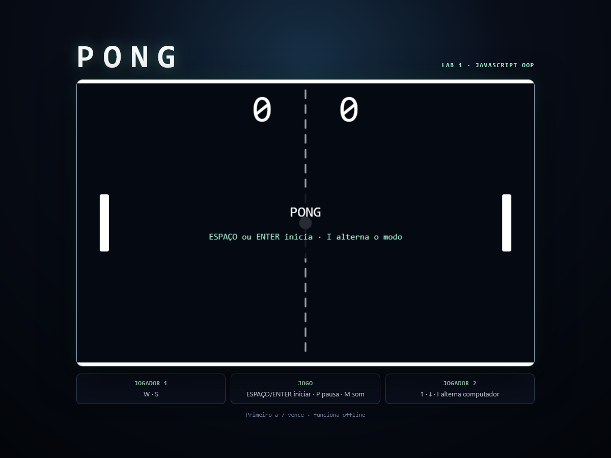

# PONG em JavaScript com OOP

Implementação autónoma do clássico **PONG**, criada para o “Lab 1: Criação em HTML, CSS e JavaScript do Jogo PONG”. O projeto usa Programação Orientada a Objetos e p5.js local, sem servidor, build ou ligação à Internet.



## Executar o jogo

1. Abra a pasta do projeto.
2. Arraste `index.html` para o Chrome ou faça duplo clique no ficheiro.
3. Prima **Espaço** para iniciar.

O endereço no browser deve começar por `file:///`. Não é necessário executar qualquer servidor.

### Controlos

| Ação | Teclas |
|---|---|
| Jogador 1 | `W` e `S` |
| Jogador 2 | `↑` e `↓` |
| Iniciar/recomeçar | `Espaço` ou `Enter` |
| Pausar/continuar | `P` |
| Ligar/desligar som | `M` |
| Alternar 2 jogadores/computador | `I` (antes de iniciar) |

O primeiro lado a atingir 7 pontos vence.

## Executar os testes

No terminal, dentro desta pasta:

```powershell
npm test
```

O comando usa apenas o Node.js e um pequeno harness próprio; não existe qualquer dependência para instalar.

Para executar exatamente as mesmas suites no browser, arraste `testes.html` para o Chrome. A página apresenta cada teste e um resumo final.

## Estrutura

```text
PongCV/
├── index.html                 # setup/draw e interface do jogo
├── testes.html                # executor de testes no browser
├── package.json               # comando npm test
├── lib/
│   └── p5.min.js              # p5.js 1.9.4 local
├── src/
│   ├── campo.js               # limites e desenho do campo
│   ├── raquete.js             # movimento e colisão da raquete
│   ├── bola.js                # movimento, ressalto e reposição
│   ├── pontuacao.js           # marcador de cada lado
│   ├── som.js                 # efeitos via Web Audio
│   └── jogo.js                # regras, estados e coordenação
└── testes/
    ├── harness.js
    ├── executar-testes.js
    └── *.teste.js
```

## Decisões técnicas

- Cada classe principal vive no seu próprio ficheiro e é exposta no escopo global para funcionar em `file://` com scripts clássicos.
- Os mesmos ficheiros oferecem `module.exports` para serem testados no Node.js.
- A lógica não depende do DOM. Os métodos `desenhar(p)` recebem a API gráfica por injeção de dependência; os testes usam um p5 falso.
- `Jogo` usa composição para coordenar `Campo`, duas `Raquete`, `Bola`, duas `Pontuacao` e `Som`.
- Os efeitos sonoros são sintetizados pelo browser, por isso também não precisam de ficheiros ou serviços externos.

## Requisitos

- Chrome, Edge ou outro browser moderno.
- Node.js apenas para `npm test`.

Não são usados módulos ES, CDN, frameworks de teste ou pacotes npm externos.

## English

Offline object-oriented JavaScript implementation of classic PONG using a local p5.js copy. Open `index.html` directly with `file:///`, press Space to start, and use `W/S` or arrow keys. The first side to reach **7 points** wins. `npm test` runs the 34 Node-based tests and `testes.html` provides the browser view of the same harness.

The project is intentionally dependency-free and works without a server or Internet connection. The public GitHub Pages demo can serve these static files, while the direct-file mode remains the canonical offline path.
